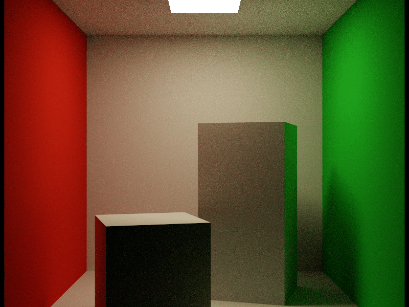

# CPU RayQuery Cornell Box

This example renders a Cornell Box entirely on the CPU. Slang compiles the compute shaders to
host-callable code, while Slang RHI builds triangle acceleration structures and executes inline
`RayQuery` traversal through TinyBVH. No GPU, ray-tracing pipeline, window, or presentation surface
is required.



The scene is generated procedurally. Its two interior blocks use the classic measured Cornell
proportions: nearly equal footprints, a 1:2 height ratio, and the short-left-front /
tall-right-back layout. One quad BLAS is instanced for the room and rectangular light, and one cube
BLAS is reused for the two blocks. Eight instances are assembled into a TLAS. The shader uses
diffuse path tracing, explicit rectangular-light sampling, shadow ray queries, Russian roulette,
progressive accumulation, and ACES-style tone mapping.

## Run it

From the SlangPy repository root, render an 800x600, 64-spp reference image:

```powershell
python -m examples.cpu_path_tracing.cpu_path_tracing `
    --width 800 `
    --height 600 `
    --spp 64 `
    --output examples/cpu_path_tracing/cornell_box.png
```

For a faster 256x256, 4-spp preview:

```powershell
python -m examples.cpu_path_tracing.cpu_path_tracing --quick
```

The quick command writes `examples/cpu_path_tracing/cornell_box_quick.png` so it does not replace
the checked-in reference image. Pass `--output` to choose another path.

The checked-in PNG is palette-optimized after rendering to stay below the repository's asset-size
limit; the renderer itself writes a full-color PNG.

Use `--samples-per-pass` to control progressive batch size, `--max-depth` to control path length,
`--seed` for deterministic sampling, and `--debug` to enable RHI validation.

The example requires a Slang RHI build with CPU RayQuery and TinyBVH support. If that feature is
missing, it exits with a message explaining how to enable it.
